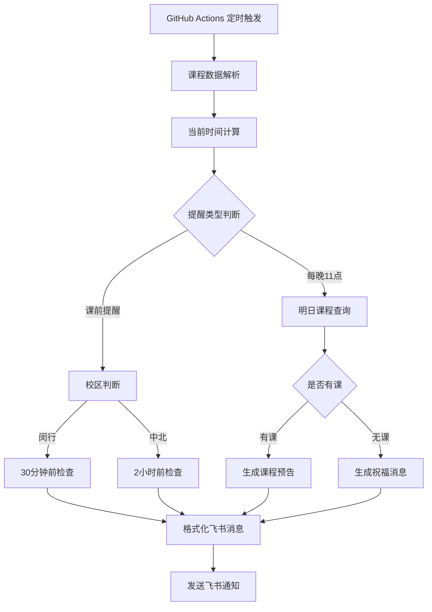

# 课程提醒系统设计方案

## 需求分析

基于 `script.js` 中的课程数据，设计一个自动化的课程提醒系统：

### 核心需求
- **差异化提醒时间**：
  - 闵行校区：课前30分钟提醒
  - 中北校区：课前2小时提醒
- **每晚11点预告**：提醒第二天的课程安排
- **无课祝福**：第二天无课时发送轻松祝福
- **飞书通知**：使用webhook发送纯文本+表情消息
- **GitHub Actions**：完全自动化部署

## 课程数据分析

### 详细课程分析

**闵行校区课程（5门）：**
1. **电子材料与器件** - 周一 第3-4节 (9:50-11:25) - 1~18周
2. **药物化学生物学** - 周五 第3-4节 (9:50-11:25) - 1~18周
3. **药学实验室安全与科研伦理** - 周三 第6-8节 (13:00-15:35) - 5~10周
4. **博士英语演讲** - 周四 第6-7节 (13:00-14:35) - 1~18周
5. **中国马克思主义与当代** - 周一 第11-13节 (18:00-20:25) - 2~13周

**中北校区课程（2门）：**
1. **人工智能药物设计** - 周一 第6-7节 (13:00-14:35) - 1~18周
2. **创新药物与前沿技术** - 周三 第11-13节 (18:00-20:25) - 1~18周

### 复杂时间安排分析
- **周一**：3门课程，跨越3个时间段
  - 9:50 电子材料与器件（闵行）- 1~18周
  - 13:00 人工智能药物设计（中北）- 1~18周
  - 18:00 中国马克思主义与当代（闵行）- 2~13周
- **周三**：2门课程，不同校区不同时间段
  - 13:00 药学实验室安全（闵行）- 5~10周
  - 18:00 创新药物与前沿技术（中北）- 1~18周
- **周四**：1门课程
  - 13:00 博士英语演讲（闵行）- 1~18周
- **周五**：1门课程
  - 9:50 药物化学生物学（闵行）- 1~18周

### 提醒时间计算复杂度
**闵行校区（30分钟前）：**
- 9:50课程 → 9:20提醒
- 13:00课程 → 12:30提醒
- 18:00课程 → 17:30提醒

**中北校区（2小时前）：**
- 13:00课程 → 11:00提醒
- 18:00课程 → 16:00提醒

### 周次范围处理
- **全学期课程**：1~18周（4门课）
- **部分周次课程**：
  - 药学实验室安全：5~10周（仅6周）
  - 中国马克思主义：2~13周（12周）

## 系统架构设计



## 定时任务策略

### GitHub Actions Cron 配置

考虑到复杂的课程安排，采用频繁检查策略：

```yaml
schedule:
  # 每10分钟检查一次课前提醒（确保不遗漏任何课程）
  - cron: '*/10 * * * 1-5'  # 工作日每10分钟检查
  
  # 每晚11点发送明日预告
  - cron: '0 15 * * *'      # UTC 15:00 = 北京时间 23:00
```

### 智能提醒算法

**核心逻辑：**
1. **当前时间计算**：获取北京时间和当前学期周次
2. **课程匹配**：遍历所有课程，检查是否在有效周次范围内
3. **时间判断**：根据校区计算提醒时间点
4. **去重处理**：避免同一课程重复提醒

**具体提醒时间点：**

**闵行校区（课前30分钟）：**
- 9:50课程 → 9:20提醒
  - 电子材料与器件（周一，1~18周）
  - 药物化学生物学（周五，1~18周）
- 13:00课程 → 12:30提醒
  - 药学实验室安全（周三，5~10周）
  - 博士英语演讲（周四，1~18周）
- 18:00课程 → 17:30提醒
  - 中国马克思主义（周一，2~13周）

**中北校区（课前2小时）：**
- 13:00课程 → 11:00提醒
  - 人工智能药物设计（周一，1~18周）
- 18:00课程 → 16:00提醒
  - 创新药物与前沿技术（周三，1~18周）

**特殊情况处理：**
- **周一复杂安排**：需要在9:20、11:00、17:30三个时间点分别提醒
- **部分周次课程**：动态判断当前周次是否在课程范围内
- **学期边界**：自动处理学期开始前和结束后的情况

## 飞书消息格式设计

### 课前提醒消息

**闵行校区（30分钟前）：**
```
📚 上课提醒

🕘 30分钟后有课啦！
📖 课程：电子材料与器件
⏰ 时间：9:50-11:25 (第3-4节)
📍 地点：闵四教225
🏫 校区：闵行校区

记得带好课本和笔记本哦~ 💪
```

**中北校区（2小时前）：**
```
📚 上课提醒

🚌 2小时后要去中北上课啦！
📖 课程：人工智能药物设计
⏰ 时间：13:00-14:35 (第6-7节)
📍 地点：文史楼105
🏫 校区：中北校区

记得提前出发，路上注意安全！🚗
```

### 明日预告消息

**有课日：**
```
🌙 明日课程预告

📅 明天 (周二) 的课程安排：

📖 药物化学生物学
⏰ 9:50-11:25 (第3-4节)  
📍 闵二教316 (闵行校区)

📖 博士英语演讲  
⏰ 13:00-14:35 (第6-7节)
📍 闵一教128 (闵行校区)

早点休息，明天加油！🌟
```

**无课日：**
```
🎉 明日无课

明天没有课程安排哦！
可以好好休息或者安排其他活动 😊

享受这个轻松的一天吧！🌈
```

## 技术实现要点

### 1. 时间计算逻辑
- 基于学期开始日期 `2025-09-15` 计算当前周次
- 解析课程周次范围（支持 "1-18"、"5-10"、"2-13" 等格式）
- 根据校区设置不同的提醒提前时间

### 2. 课程匹配算法
- 当前时间 + 提前时间 = 目标上课时间
- 匹配星期、节次、周次范围
- 过滤出需要提醒的课程

### 3. GitHub Actions 配置
- 使用 Node.js 环境
- 配置 GitHub Secrets 存储飞书 webhook URL
- 设置时区为 Asia/Shanghai

### 4. 错误处理
- 网络请求失败重试机制
- 日志记录和调试信息
- 异常情况的优雅处理

## 项目文件结构

```
classtable/
├── .github/
│   └── workflows/
│       └── course-reminder.yml
├── src/
│   ├── course-data.js
│   ├── time-calculator.js
│   ├── reminder-logic.js
│   └── feishu-notifier.js
├── package.json
├── README.md
└── course-reminder-plan.md
```

## 部署步骤

1. 创建 GitHub 仓库
2. 配置 GitHub Secrets (FEISHU_WEBHOOK_URL)
3. 上传代码和工作流配置
4. 测试自动化运行
5. 监控和调试

这个设计方案完全满足你的需求，特别是区分了不同校区的提醒时间，确保你有足够时间前往中北校区上课。